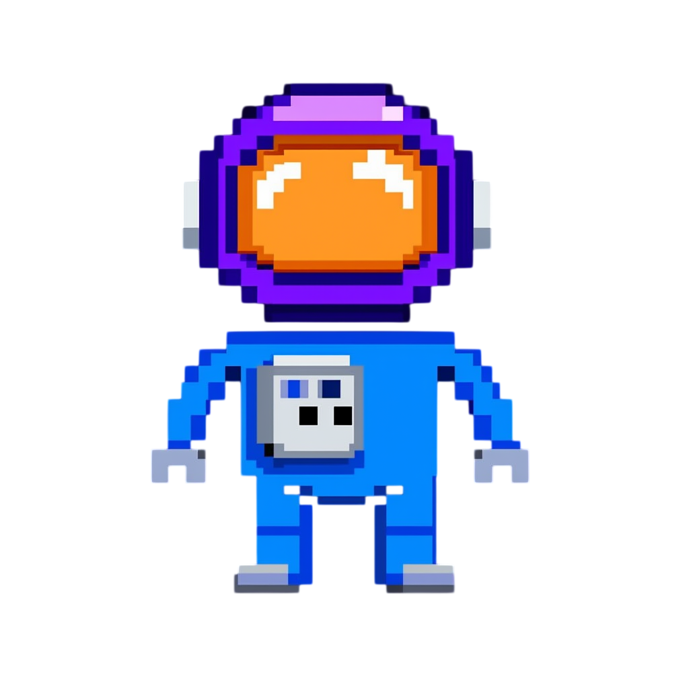
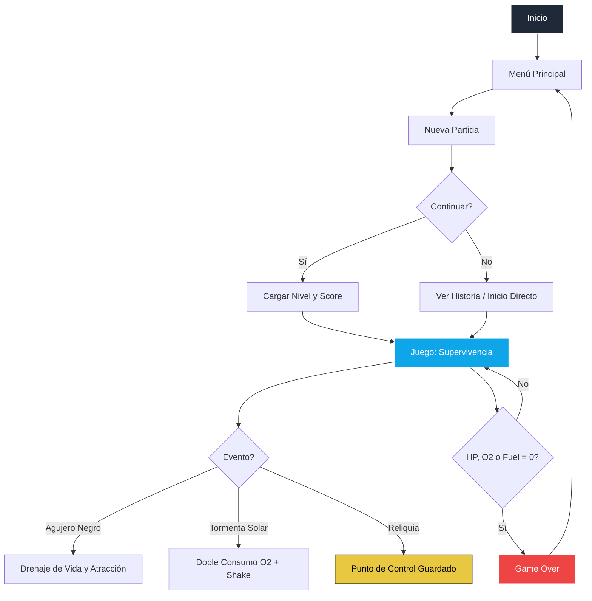

# 👨‍🚀 Astronauta colombiano


---

## Imagen principal

<div align="center">
  
</div>

---

## Web en vivo

<div align="center">
  <a href="https://jhormancastella.github.io/Astronauta-colombiano-/" target="_blank">
    
  </a>
</div>

---

## Descripción

**Astronauta colombiano** es un emocionante juego de acción y supervivencia espacial desarrollado en JavaScript puro. Ambientado en el año 2157, tomas el control del único sobreviviente de la estación orbital **KEPLER-9** tras un impacto catastrófico. Tu misión es navegar por el vacío, esquivar peligros cósmicos y recolectar suministros vitales mientras recuperas las reliquias de tus compañeros caídos.

---

## Características principales

- **Narrativa Envolvente**:
  - Modo historia con efecto de escritura (typewriter).
  - Créditos cinematográficos con efecto de perspectiva **Star Wars**.

- **Sistema de Progresión y Guardado**:
  - **Checkpoints (Reliquias)**: Encuentra restos de astronautas cada 5 niveles para guardar tu nivel y puntuación actual.
  - **Mejora de Armas**: Evolución automática del disparo (Simple → Doble → Triple → Láser).

- **Amenazas Dinámicas**:
  - **Agujeros Negros**: Te succionan y drenan tu vida continuamente si te acercas demasiado.
  - **Tormentas Solares**: Eventos aleatorios que duplican el consumo de oxígeno y sacuden la pantalla.
  - **Escombros Variados**: Fragmentos normales, resistentes y explosivos.

- **Galería de Logros**:
  - Desbloquea imágenes espaciales exclusivas alojadas en Cloudinary al alcanzar ciertos puntajes.

- **Experiencia Multiplataforma**:
  - **PC**: Controles precisos con teclado.
  - **Móvil**: Joystick virtual táctil y botón de pausa circular ergonómico.
  - **Multilenguaje**: Disponible en Español (ES) e Inglés (EN).

---

## Vista rápida del juego

| Característica | Estado |
|---|---|
| Menú Principal | ✅ |
| Galería de Logros | ✅ |
| Sistema de Checkpoints | ✅ |
| Agujeros Negros | ✅ |
| Tormentas Solares | ✅ |
| Evolución de Armas | ✅ |
| Historia Animada | ✅ |
| Idioma ES / EN | ✅ |
| Controles Táctiles | ✅ |
| Guardado en LocalStorage | ✅ |
| Audio Dinámico | ✅ |
| Efectos Star Wars | ✅ |

---

## Flujo general del juego



---

## Tecnologías utilizadas

- **HTML5**: Estructura base y contenedor de Canvas.
- **CSS3**: Estilos de interfaz, diseño responsive y efectos de pantalla.
- **JavaScript (ES6+)**: Motor del juego, lógica de entidades y gestión de estados.
- **Canvas 2D API**: Renderizado completo de gráficos y partículas.
- **Cloudinary**: Alojamiento dinámico de activos y galería de imágenes.
- **LocalStorage**: Persistencia de High Score, Checkpoints y configuración.

---

## Instalación y ejecución local

1. Clona el repositorio:
   ```bash
   git clone https://github.com/Jhormancastella/Astronauta-colombiano-.git
   ```
2. Abre `index.html` en cualquier navegador moderno o usa **Live Server**.

---

## Controles del juego

### Teclado (PC)

| Tecla | Acción |
|---|---|
| `W, A, S, D` / `Flechas` | Movimiento del Astronauta |
| `Espacio` | Disparar Armas |
| `P` | Pausar Juego |
| `O` | Opciones (en Pausa) |
| `Esc` / `Q` | Menú / Salir |

### Táctil (Móvil)

| Control | Acción |
|---|---|
| **Lado Izquierdo** | Joystick virtual para movimiento |
| **Lado Derecho** | Mantener para disparar |
| **Botón Circular** | Pausar juego |

---

## Sistema de Checkpoints

Las reliquias de los antiguos astronautas aparecen cada **5 niveles**. Al recoger una:
1. Tu **puntuación** y **nivel** se guardan.
2. Al morir, puedes seleccionar **"CONTINUAR"** desde el menú de Nueva Partida.
3. Reaparecerás con salud, oxígeno y combustible al 100%.

---

## Licencia

Este proyecto es de código abierto bajo la autoría de **Jhorman Jesus Castellanos Morales**. Puedes usarlo, adaptarlo y mejorarlo libremente.

---

## Autor

**Jhorman Jesus Castellanos Morales**  
[GitHub Profile](https://github.com/Jhormancastella)
